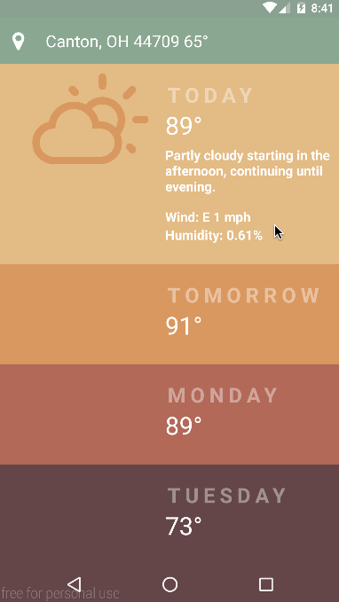

#nativescript-weather

a weather app inspired by [Sergey Valiukh dribbble](https://dribbble.com/shots/1824088-GIF-for-the-Weather-App) built with NativeScript and Angular 2

Special Thanks to [Alexander Vakrilov](https://github.com/vakrilov) for helping me get the Angular 2 router working